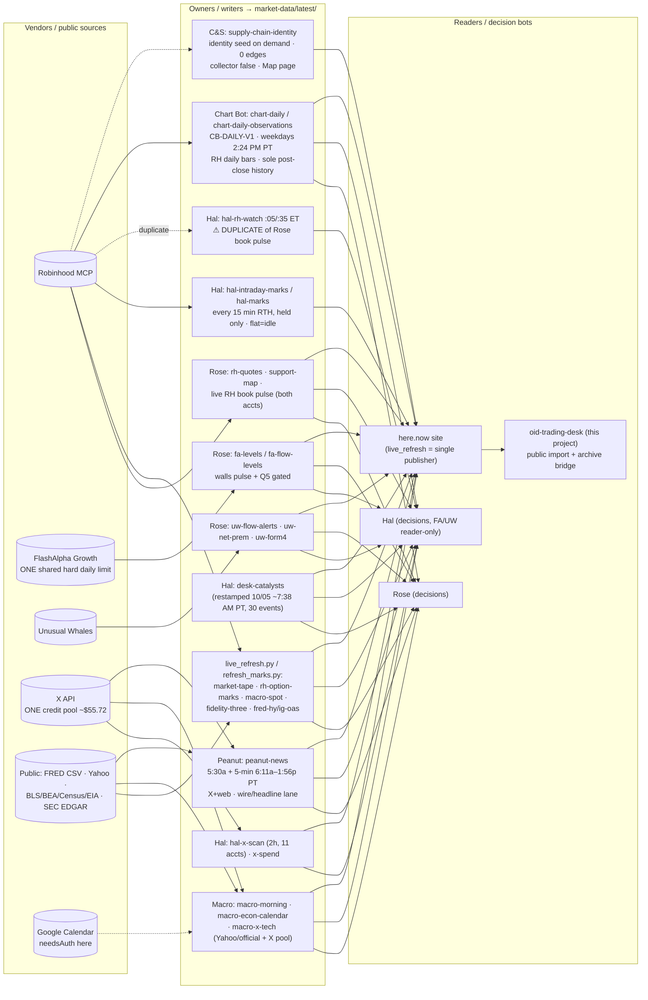

# Query architecture: one call, many readers

As of 2026-10-05 (PT). Research/paper only. This document builds on the live policy `/workspace/options-intelligence-desk/market-data/QUERY-DEDUP.md` (V0) and does not replace it. It describes the **production** layout and marks proposed pieces explicitly.

## Principle
Each vendor endpoint has **one owner** that writes `market-data/latest/{feed}.json`. Every other bot **reads that file** (`cache_io.read_fresh`) and makes no call of its own. Decision bots (Rose, Hal) reason over files; producer bots (Chart, Macro, Peanut, C&S) own only their own feeds. The single exception is the **live RH quote at elevate/invalidate** (≤120 s), which is never served from cache.

## Shared collectors vs decision bots

| Role | Kind | Owns (writes) | Reads | Must not |
| --- | --- | --- | --- | --- |
| **Rose** | decision + primary collector | `fa-levels`, `fa-flow-levels`, `uw-flow-alerts`, `uw-net-prem`, `uw-form4`, `rh-quotes`, `support-map`, live RH book pulse, paper ledger, `api-quotas` FA notes, Form-4/EDGAR premarket | everything | serve elevate gates from cache |
| **Hal** | decision | `hal-intraday-marks` / `hal-marks` (RH option marks on held Hal seats, every 15 min RTH `:11/:26/:41/:56` ET; flat book = idle); `hal-rh-watch` / `hal-rh-watch-pulse` (Tech∪chip soft tape `:05/:35` ET — **duplicate**, see below); `hal-x-scan` + `x-spend` (every 2h, 11 allowlisted accounts, shared X credits); `desk-catalysts` (soft calendar owner; restamped 2026-10-05 ~7:38 AM PT, 30 events; never elevates alone) | `fa-levels` (Rose file — any Hal FA burn logs against shared pool), `uw-*`, `rh-quotes`, chart, macro, peanut | pull FA/UW when `latest/` is fresh; second EDGAR/Form-4 collector; Databento/Massive bars; 60s quote cadence (design only); Benzinga; live RH order path (research/alerts/paper only — never place/modify/cancel/exercise RH unless Jeffrey separately names a live Agentic ticket) |
| **Chart Bot** | producer | `chart-daily` → `chart-bot/observations/{SYMBOL}.json`, `chart-bot/latest/chart-daily-observations.json`, copy to `market-data/latest/chart-daily-observations.json` (**sole writer of post-close daily historicals**). Rule **CB-DAILY-V1**. Routine `chart-daily-refresh` weekdays **2:24 PM PT** after cash close; weekend/holiday keep last completed session. Universe **RH-TECH-CHIP-20261004** (Tech∪chip, 37; **GOOG Class C only**; benchmarks QQQ+SMH on lists; SOXX not fetched). Soft only; never elevates; forecasts null; pattern detector off. Site: `chart.html`. | — | FA/UW/X/Databento/Massive; Rose/Hal live quote pulse (Chart is post-close history only); duplicate `get_equity_historicals` elsewhere; 5/15/60-min bars · weekly bars · 1-min RVOL · pattern detector · SOXX · forecasts/probabilities · push receiver · changes API (all **N/A**) |
| **Macro Bot** | producer | `macro-morning` (weekday ~5:45 AM PT soft-color pack: `daily_macro` + `macro_tech` (−2…+2), seven `metric_scores`: 10Y_yield, oil_WTI_Brent, USD_DXY_or_USDJPY, VIX, NQ_vs_ES, credit_HYG_day, event_calendar; chat + Rose/Hal priority; file writer ~6:14 AM PT → `market-data/latest/macro-morning.json`; today's row 2026-10-05 5:50 AM PT); `macro-econ-calendar` (weekday ~5:50 AM PT day card + one-shot post-prints on clear deltas); `macro-x-tech` (hourly weekdays 9:10–3:10 ET; clear deltas only to Jeffrey + Rose + Hal) | public Yahoo quote pages + official BLS/BEA/Census/EIA release pages (no key); Google Calendar for econ calendar; X from shared credit pool | FA / UW / RH quote calls; Trading Economics frozen consensus · CME FedWatch · Databento · FRED HY/IG OAS as credit (uses HYG day) · 2Y/real yields · 15-min material-change check / three briefs a day · versioned release records · API · push receiver (all **N/A**); orders |
| **Peanut** | producer | `peanut-news` → `market-data/latest/peanut-news.json` (+ Live Book marquee for alerts after prior RTH close; `news-archive.html`). Cadence: weekdays **5:30 AM PT** premarket + **every 5 min 6:11 AM–1:56 PM PT**. Universe RH Tech∪chip (~37). Writes chat + Rose/Hal alerts on move-worthy items; quiet scans do not rewrite the file. | X news search + public web (shared X pool); shared watchlist snapshot | FA / UW / RH quote calls; SEC · IR · Form 4 · policy feed · Benzinga websocket · immutable revisions · read API (all **N/A**). **Lane split:** Peanut owns wire/headline; **X Summarizer** owns X-edge — do not double-count. Map/identity is **C&S**, not Peanut. Note: package path `peanut/` not yet on disk (logic lives in `dashboard/peanut_news.py`) |
| **C&S** (Customer/Supplier) | producer | `supply-chain-identity` (desk-store identity snapshot; `collector: false`; paper store `supply-chain/supply-chain.db`; Map page). Cadence: **on demand / identity seed** — no weekday collector loop. Counts: 37 entities / 37 instruments / **0 relationships** / 0 claims (empty edges = unknown exposure, not failed; softOnly TTL none — empty ≠ STALE). One Alphabet = **GOOG Class C** only. SKHY and MH ticker-only/unverified legal name. | Shared Tech∪chip watchlist snapshot; RH `get_sec_filing_index` when filing evidence needed (shared path, not a second EDGAR) | Benzinga · FactSet · EIA · Form4 · issuer-IR · policy feed · immutable Postgres · read API · push receiver · FA/UW/X for map · inventing edges · parallel EDGAR/news/X · elevating from business events · live orders. Soft color / empty map never opens a seat; profit probabilities null. |
| **live_refresh.py** | shared infra | `market-tape`, `rh-option-marks`, `macro-spot`, `fidelity-three`, FRED OAS, site build + publish | all `latest/` files | run a second publisher loop |

The **Tech∪chip watchlist snapshot** (37 names, id `RH-TECH-CHIP-20261004`) is one shared list. Chart, Peanut, C&S and Hal use the same symbol set, so they should read one membership file rather than re-resolving watchlists through RH every run. **GOOG Class C only** (no GOOGL) across Chart and C&S.

## Duplicate-query risks (fix list)

1. **RH Tech+chip watchlist quotes have two writers.** Rose's `oid-live-rh-book-pulse` (`tmp/live-rh-book-last.json`, 44 watchlist movers, both accounts) and Hal's `hal-rh-watch` / `hal-rh-watch-pulse` at `:05/:35` ET (37-symbol union via `get_equity_quotes`, 2 batches) quote the same names on overlapping cadences. **Fix (flagged, not changed):** one writer to `rh-quotes`; the other reads with `read_fresh(ttl=120)` and only quotes on a miss. Needs Rose and Hal agreement; no cron changed in this fold.
2. **RH equity quotes also come from `support-map` (every 15 min) and `live_refresh` `market-tape`.** These should piggyback on the same fresh `rh-quotes` record when it is within TTL, not re-quote the identical names.
3. **Option marks have two paths.** `refresh_marks.py` writes `rh-option-marks` and Hal writes `hal-intraday-marks` / `hal-marks`. With the book flat the impact is near zero. When seats reopen, quote each held contract once per cycle and let the other path read it.
4. **FlashAlpha Growth is one hard limit.** Hal's Oct 1 RH-WATCH-8 `get_levels` (AMD, BE) burned shared quota. Rule: Hal reads `fa-levels`. Any exception is logged on Rose (`api-quotas.json` notes). At quota 0, everyone writes or reads STALE_CARRY and nobody retries.
5. **X is one credit pool.** Hal (2-hourly), Macro (`macro-x-tech` hourly weekdays), Peanut (5-min news scans), X Summarizer and Startup Hunter all draw from the same balance (about $55.72). Proposal: per-bot daily caps recorded in `x-spend.json`. Peanut and Hal should not both search the same handles or tickers inside the same window; read each other's file first.
6. **Catalysts.** `desk-catalysts` has one writer (Hal). Rose and others read it instead of calling FA or RH earnings calendars. Restamped 2026-10-05 ~7:38 AM PT (30 events); never elevates alone.
7. **Chart vs Rose/Hal live quote pulse.** Chart does **not** share the Rose/Hal live RH quote pulse. Chart owns only the **post-close daily history** path: Robinhood `get_equity_historicals` (interval day, bounds regular, adjustment split, start ~2024-01-01Z; one call per symbol per weekday ≈37/day). Do not duplicate that pull elsewhere. Indicators: EMA9/21 + SMA50/200 (Shay lineage); SMA20 + ATR14 engineering-only/unvalidated; `total_trend` Bullish/Bearish/Hold/UNAVAILABLE; RS 20-session vs QQQ and SMH.
8. **C&S vs Peanut ownership.** Production Map / identity is **Customer/Supplier Bot** (identity + future evidenced edges). Peanut owns news scores/alerts only. Prefer one shared watchlist snapshot; reuse shared RH filing-index — no parallel EDGAR/news/X from C&S. Handbook five-bot guide wrongly put map under News; see HANDBOOK-ERRATA.
9. **Peanut vs X Summarizer lane split.** Peanut owns the **wire/headline** news lane (`peanut-news`). X Summarizer owns the **X-edge** lane. Do not double-count the same story across both.

## Archive path (for backtesting)
- **Live working set:** `/workspace/options-intelligence-desk/market-data/latest/` (overwrite-in-place, one file per feed).
- **Intended immutable bundles (proposed, not built):** `market-data/snapshots/YYYY-MM-DD/<HHMMSS>-<sha256-prefix>/` containing a copy of each changed `latest/*.json` plus `manifest.json` (file, sha256, as_of, writer, captured_at_pt). Write once and never edit. Corrections go in as new bundles.
- **Public-page bundles (implemented here):** `oid-trading-desk/data/reference-snapshots/<content-hash>/` for the eight here.now resources.
- See `data/live-bridge.md`. Licensed vendor payloads stay on the box. Do not redistribute them.
